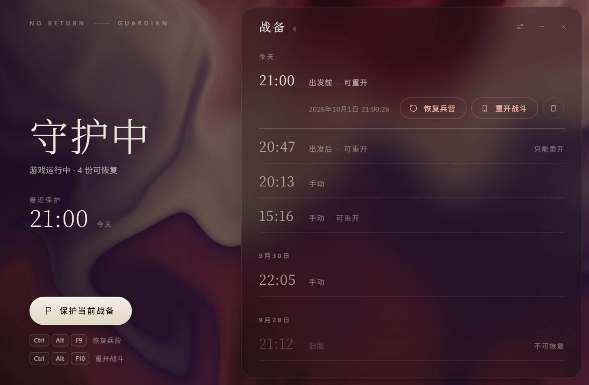

# 赴死之旅守护器

**死在遭遇里，不必丢掉整趟征途。**

为《最后生还者 II 重制版》PC 版“赴死之旅”而做：出发前自动存下兵营里的战备， 
战死后按一下快捷键，回到出发前重新准备，或者直接重打这一场。

**[下载最新版](https://github.com/Zane-0x5a/no-return-guardian/releases/latest)** · [使用](#使用) · [常见问题](#常见问题)

## 能做什么

- **恢复兵营** `Ctrl+Alt+F9`：回到出发前的兵营，资源、装备和路线都和当时一样，可以重新准备。
- **重开战斗** `Ctrl+Alt+F10`：回到出发前，再按你选过的路线自动出发，直接重打同一场。
- **出发自动保存**：你从路线板出发的那一刻，自动存下出发前的战备。

全程都在游戏里完成，不用退出游戏。

## 安装

1. 从 [Releases](https://github.com/Zane-0x5a/no-return-guardian/releases/latest) 下载 `NoReturnGuardian-<版本>-setup.exe` 并运行，不需要管理员权限。想免安装就下载 `NoReturnGuardian-<版本>-win-x64.zip`，解压后运行 `NoReturnGuardian.exe`。
2. 如果 Windows 提示“已保护你的电脑”，点“更多信息”→“仍要运行”。

需要 64 位 Windows 10 或 11。Windows 10 上缺少 WebView2 运行时的话，安装程序会给出下载地址。

以后有新版本时，窗口左上角会出现“更新到 x.y.z”，点一下就会自动下载并装好。

## 使用

1. 打开守护器，它会待在托盘里。启动游戏，进入赴死之旅。
2. 在兵营准备好后，从路线板出发。守护器会存下出发前的战备，托盘提示“已在出发时保存战备”。想在兵营里另存一份，点窗口里的“保护当前战备”。
3. 战死后停在结算页时：
   - 按 `Ctrl+Alt+F9`：回到兵营；
   - 按 `Ctrl+Alt+F10`：重开这场战斗。

   已经回到赴死之旅菜单时也可以按；在战斗中按，会先放弃这一场。

恢复时让游戏留在前台，通常半分钟内完成。想回到更早的战备，就在窗口右侧的清单里选中它，点“恢复兵营”或“重开战斗”。

> 托盘图标里那扇小门是香槟色时，现在就可以保护战备；变成石榴红，说明征途可能已经结束。
>
> 窗口里可以用键盘操作：↑↓ 选择，Enter 恢复，Delete 删除，Esc 关闭面板。

## 常见问题

**按了快捷键，提示现在不能恢复？** 
你站在别的兵营里时（比如赢下一场之后，或者重启游戏后继续进来的兵营），两个动作都不可用。先在暂停菜单退回赴死之旅菜单，再按一次。

**游戏更新后，提示代码“和验证过的版本不一样”？** 
这次游戏更新改到了守护器要用的部分，需要等守护器发布新版本。在那之前仍然可以保护战备，完整退出游戏后在窗口里恢复兵营。

**快照存在哪里？** 
在 `%LOCALAPPDATA%\NoReturnGuardian`。升级和卸载都会保留它们，不需要时直接删除这个文件夹。

**遇到问题怎么反馈？** 
提交 [Issue](https://github.com/Zane-0x5a/no-return-guardian/issues)，附上 `%LOCALAPPDATA%\NoReturnGuardian\guardian.log`，以及快照库 `native-recovery-logs` 文件夹里出问题那次的 `recovery-*` 文件。日志里的存档路径带有平台账号 ID，公开前可以把它替换掉。

---

非官方工具，与 Naughty Dog、Sony Interactive Entertainment 无关。游戏内恢复会临时挂接游戏进程，可能不符合游戏的最终用户许可协议，请自行判断。 
[MIT 许可证](LICENSE) · [第三方组件](THIRD_PARTY_NOTICES.md) · [从源码构建](CONTRIBUTING.md)
